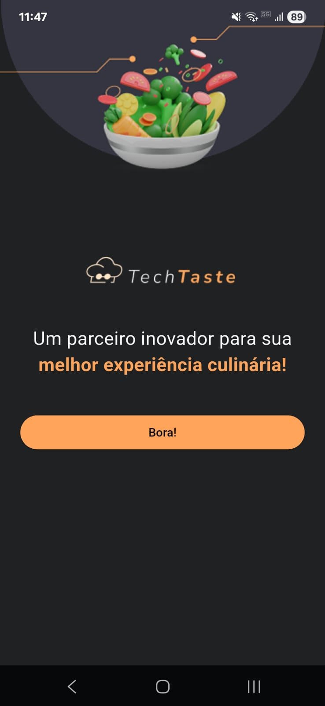
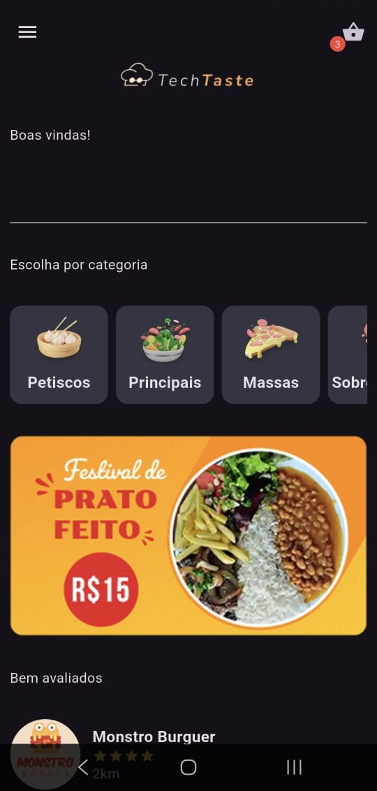
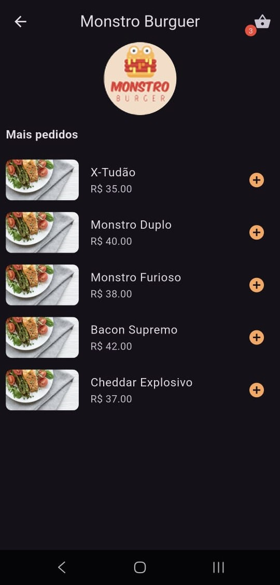
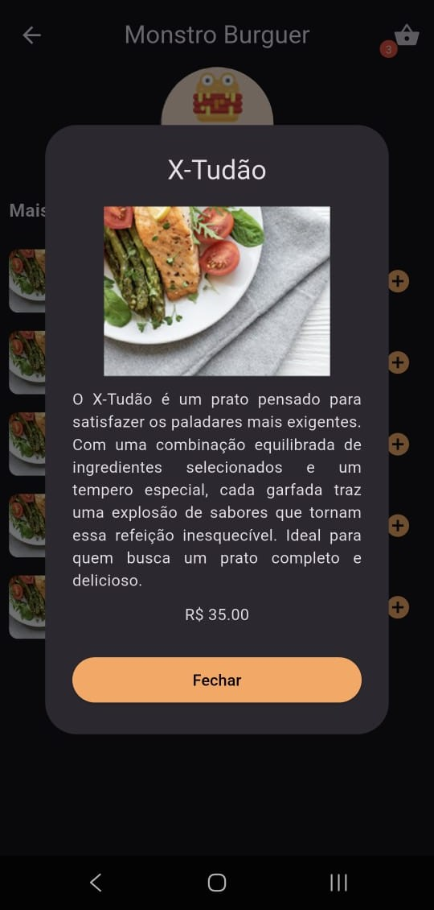
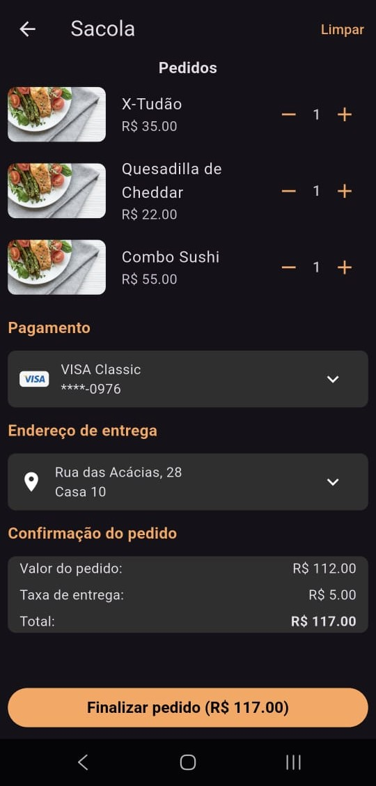

# projetoflutter

A new Flutter project.

## Getting Started

This project is a starting point for a Flutter application.

A few resources to get you started if this is your first Flutter project:

- [Lab: Write your first Flutter app](https://docs.flutter.dev/get-started/codelab)
- [Cookbook: Useful Flutter samples](https://docs.flutter.dev/cookbook)

For help getting started with Flutter development, view the
[online documentation](https://docs.flutter.dev/), which offers tutorials,
samples, guidance on mobile development, and a full API reference.

## Descrição do projeto

Este projeto foi desenvolvido baseando-se na Imersão Mobile promovida pela Alura. Trata-se de um aplicativo de restaurantes, permitindo visualizar os estabelecimentos cadastrados, explorar seus respectivos pratos e adicionar pedidos à sacola. Nem todas as funcionalidades estão implementadas, o foco principal foi explorar a **construção de interfaces gráficas com Flutter**, **entender conceitos da linguagem Dart** e, principalmente, trabalhar com o **gerenciamento de estado global utilizando o Provider**. Sendo assim, o projeto pode ser retomado no futuro para possíveis incrementos.

## Interfaces Desenvolvidas

<b>Splash Screen</b>

,

 

<b>Home Screen</b>

 

<b>Restaurant Screen</b>

 

<b>Detalhes do prato selecionado (ao clicar em um elemento em Restaurant Screen)</b>

 

<b>Checkout Screen</b>

